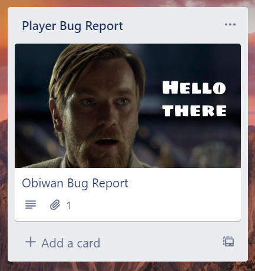
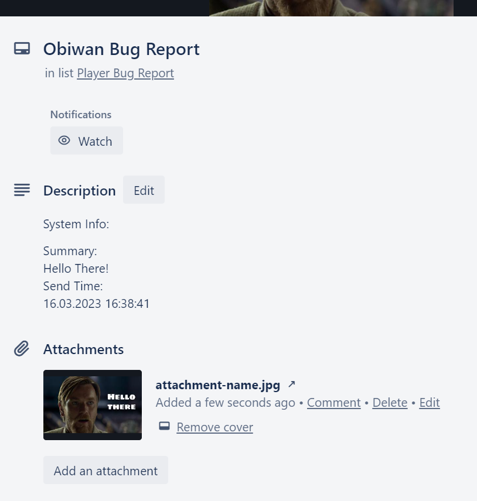

## Bug Report System
A Bug Report System integrate with other plateform(currently Im using this project on my games, so )

## Getting Started
[Download dll](https://github.com/keithlau2015/BugReportSystem/raw/main/BugReportSystem/bin/Debug/net7.0/BugReportSystem.dll), and import into your project

### How to use Bug Report
Below is a simple code sample usecase
```c#
using BugReportSystem;

public class Program{
    public static async Task Main(string[] args)
    {
        //Config plateform activation
        BugReport bugReport = new BugReport(new Dictionary<BugReport.SupportItemIndex, bool>{ 
            {BugReport.SupportItemIndex.Trello, true}
        });

        //Every plateform may have different parameters
        //In this case, using trello, there are few parameters you must to filled in, and able to use the trello api
        bugReport.allItems[BugReport.SupportItemIndex.Trello].parameters["API_KEY"] = "YOUR TRELLO API KEY";
        bugReport.allItems[BugReport.SupportItemIndex.Trello].parameters["API_TOKEN"] = "YOUR TRELLO API TOKEN";
        bugReport.allItems[BugReport.SupportItemIndex.Trello].parameters["BOARD_NAME"] = "YOUR TRELLO BOARD NAME";
        bugReport.allItems[BugReport.SupportItemIndex.Trello].parameters["DEFAULT_LIST_NAME"] = "YOUR TRELLO DEFAULT LIST NAME";

        //The actual report context
        bugReport.title = "Obiwan Bug Report";
        bugReport.summary = "Hello There!";
        bugReport.sendTime = DateTime.Now;
        //attachment is optional
        //bugReport.attachment = File.ReadAllBytes("image.jpg");
    
        //If return true, that's mean all the operation are successful executed
        bool success = await bugReport.SendReport();
        
        Console.WriteLine(success);
    }
}
```


There you go!

### Currently Support Plateform
1. Trello

## Contributing
Contributions are what make the open source community such an amazing place to learn, inspire, and create. Any contributions you make are **greatly appreciated**.

If you have a suggestion that would make this better, please fork the repo and create a pull request. You can also simply open an issue with the tag "enhancement".
Don't forget to give the project a star! Thanks again!

1. Fork the Project
2. Create your Feature Branch (`git checkout -b feature/AmazingFeature`)
3. Commit your Changes (`git commit -m 'Add some AmazingFeature'`)
4. Push to the Branch (`git push origin feature/AmazingFeature`)
5. Open a Pull Request

## Contact
Project Link: [EditorBootloader](https://github.com/keithlau2015/EditorBootloader)
